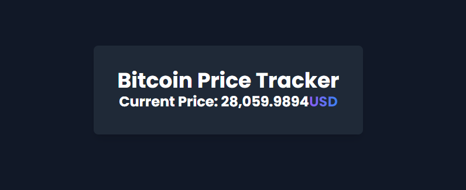

# Simple Bitcoin Tracker

I created a code to track the cost of bitcoin with Chat GPT. 
I am using Python (Flask) and HTML (Tailwind CSS) programming language in this project. 
Every few seconds after refreshing, the price of Bitcoin changes.

